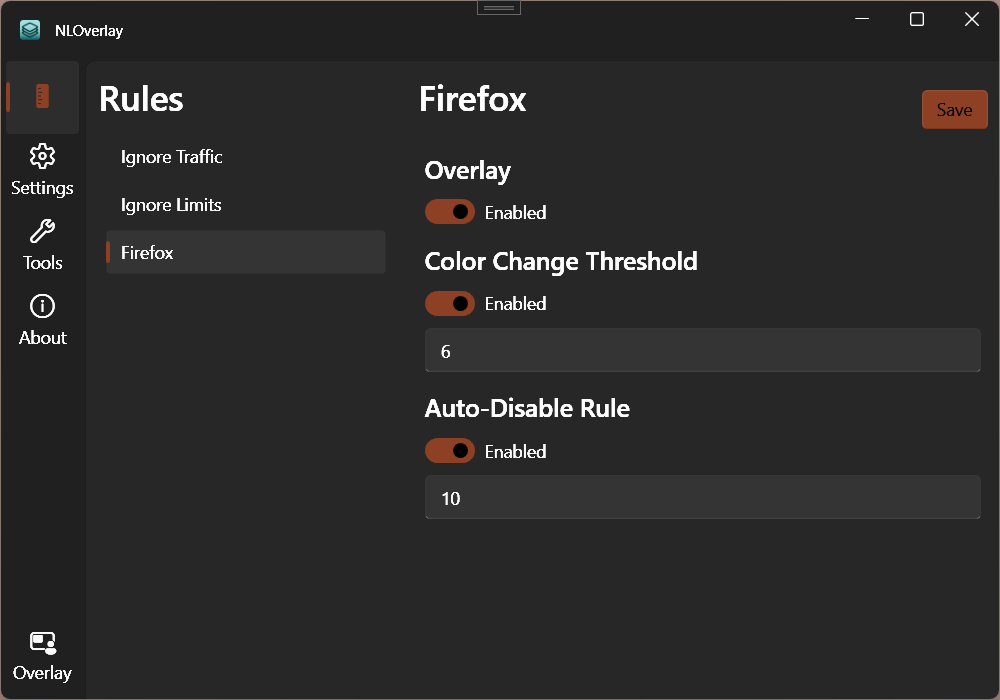

#  NLOverlay 

NLOverlay is a Windows overlay designed for NetLimiter, providing a clear view of active rules and their duration.

## Key Features

- **Automatic Rule Disabling:** Define a threshold in seconds, and NLOverlay will automatically disable the rule once the time limit is reached. This ensures your network rules are only active when needed.

- **Dynamic Color Coding**: Rules change color within the overlay once a predefined threshold is reached.

## Screenshots

### Rules Page

On this page you can see all the rules that you have created on NetLimiter.
You can choose which ones appear on the overlay and define specific thresholds.

### Settings Page

On this page you can set all the settings related to the overlay.

*The polling rate determines the frequency, in milliseconds, at which the displayed value in the overlay is refreshed or updated.*

### Overlay Window

The overlay can be launched by clicking the `Overlay` button on the sidebar.
This button also refreshes the overlay if settings were modified.

## Setup

- Ensure NetLimiter is installed and running
- Set `RequireElevationLocal` to `false` in NetLimiter configuration file. Without this, the program will likely misbehave since it's API access is very limited. More info [here](https://github.com/LocktimeSoftware/NetLimiterApiSamples?tab=readme-ov-file#how-to-allow-non-elevated-client-to-modify-netlimiter-settings).
    1. Stop the NetLimiter service `net stop nlsvc`
    2. Edit the configuration `nl_settings.xml`
        - Usually located in `C:\ProgramData\Locktime\NetLimiter\5`
        - Ensure the elevated permissions. `<RequireElevationLocal>false</RequireElevationLocal>`
    3. Start the NetLimiter service `net start nlsvc`

## Usage

You can run the app by downloading and running the setup `.exe` from the [releases page](https://github.com/tzoug/NLOverlay/releases) or by [building the solution](#building-the-solution)

## Building The Solution

1. Ensure [.NET 4.6.2 developer pack](https://dotnet.microsoft.com/en-us/download/dotnet-framework/net462) is installed.

2. Open `NLOverlay.sln` with VisualStudio

3. Start the `NLOverlay` C# project 

## Resources

- [WPFUI](https://github.com/lepoco/wpfui)
- [NetLimiterAPI](https://www.netlimiter.com/docs/api)
